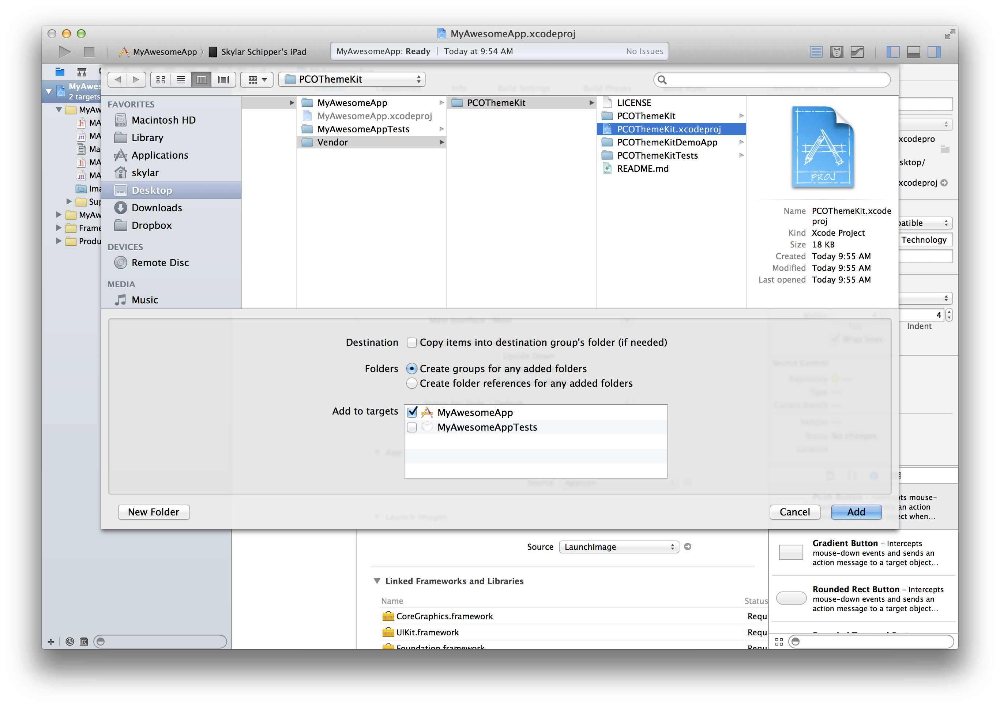
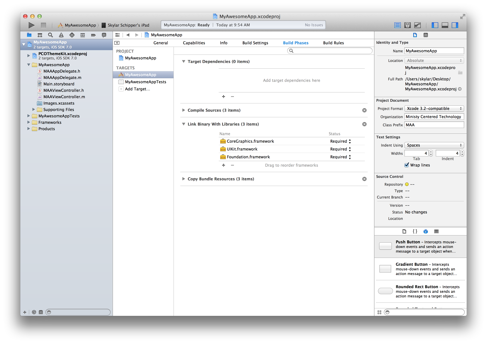
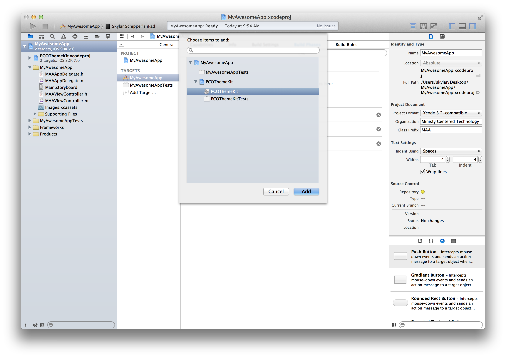
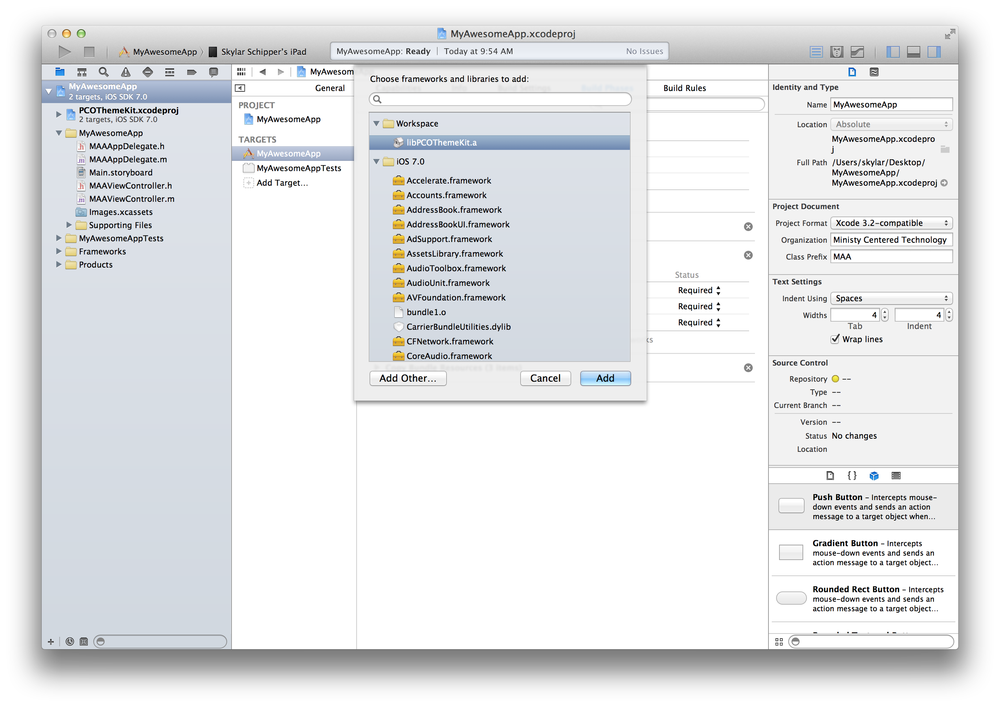
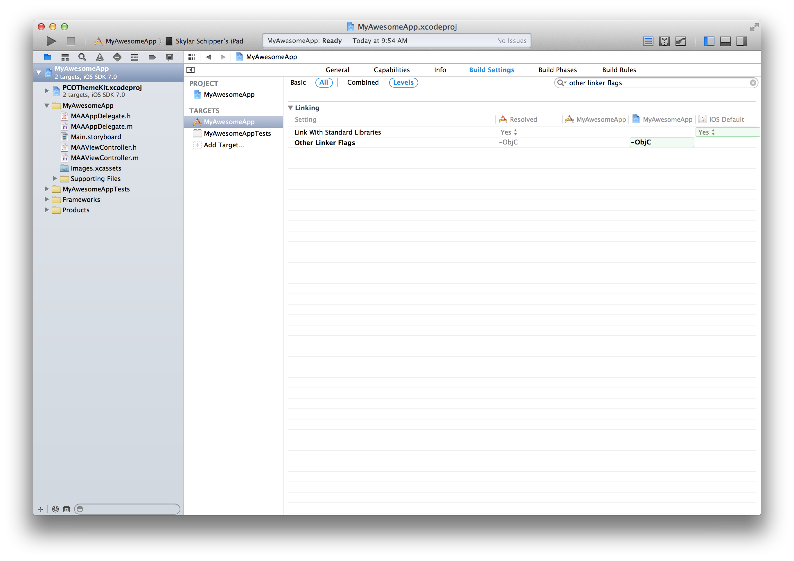
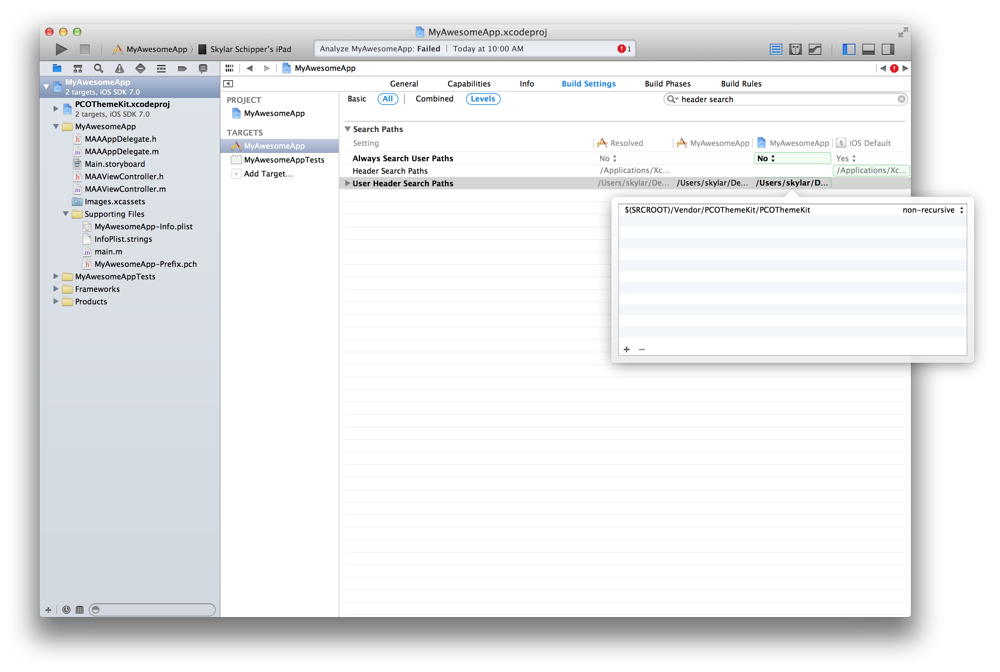
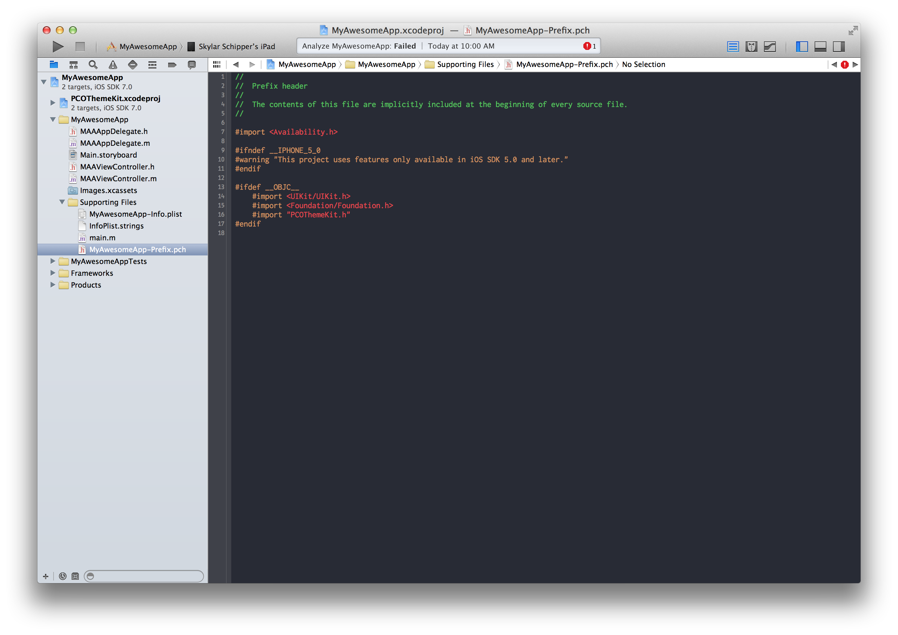
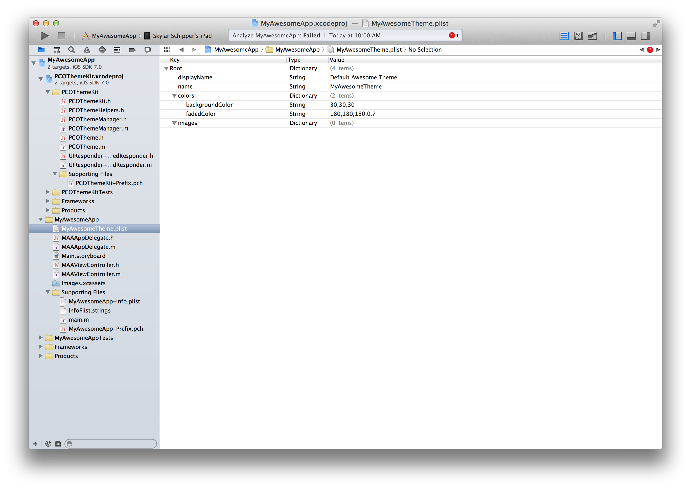
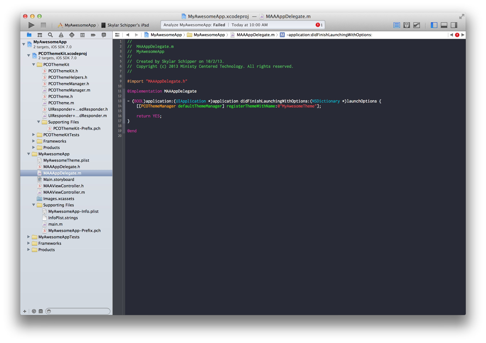

PCOThemeManager
===============

## Theme File Structure

A theme file is a simple plist.

It should have a root `<dict>` object.

There are 4 required keys for the theme.

1. `name` This is the name of the theme.  It should match the file name of the plist.
2. `displayName`  The name of the theme that can be displayed to the user.
3. `colors`  A dictionary object of colors strings.  The colors are a csv string of `red,green,blue,(alpha)` with alpha being optional.  RGB are 0-255 and alpha is 0-1
4. `images`  A dictionary of image names for the theme.

## Installation

##### Add as a submodule.
	
	$ git submodule add https://github.com/ministrycentered/PCOThemeKit.git Vendor/PCOThemeKit

Once git has cloned the project hop into Xcode.

##### Add PCOThemeKit to the project

##### Go to the Build Phases tab in your project

  - Under `Target Dependencies` click `+`
  
  - Add `PCOThemeKit`
  
  
  
  - Under `Link Binary With Libraries` click `+`
  
  - Add `libPCOThemeKit.a`
  
  
  
##### Got to the Build Settings tab in your project

  - Search for 	`other linker flags`
  
  - Add `-ObjC` to `Other Linker Flags`
  
    This tells Clang & LLVM to compile the PCOThemeKit class extensions
  
  
  
  - Search for `header search path`
  
  - Add `$(SRCROOT)/Vendor/PCOThemeKit/PCOThemeKit` to `User Header Search Paths`
  
    This tells Xcode where to look for headers
    
  
  
##### Add `#import "PCOThemeKit.h"` to pre-complied header.

##### Create theme file

##### Register theme with the manager

